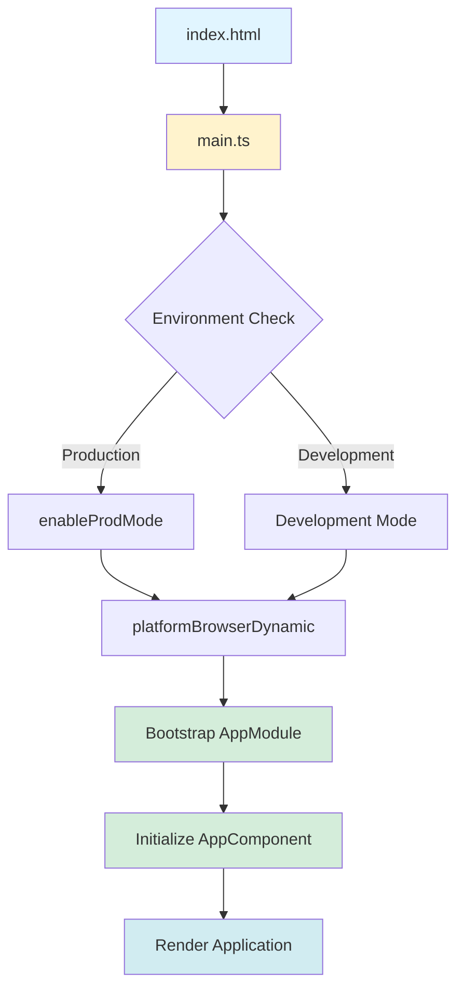
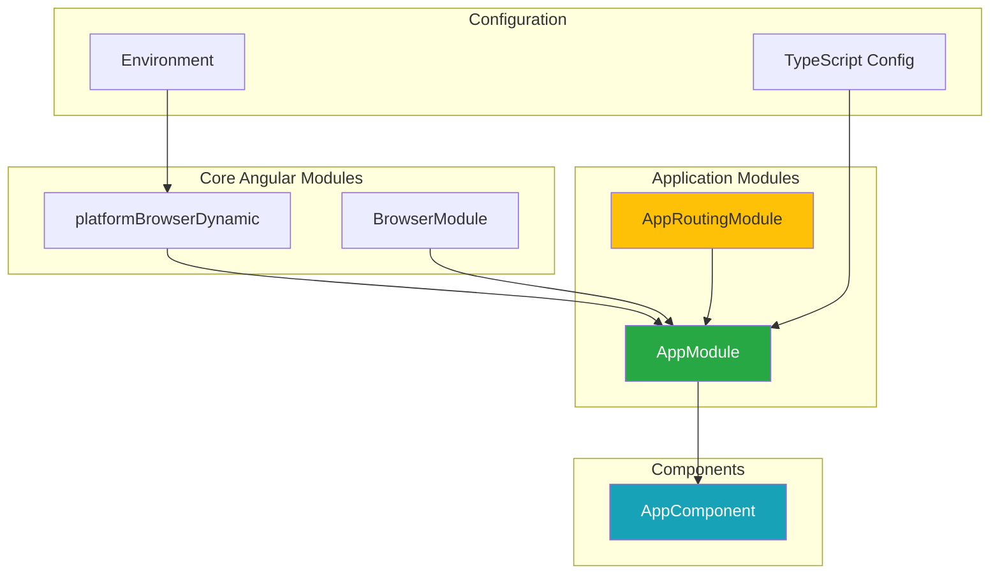
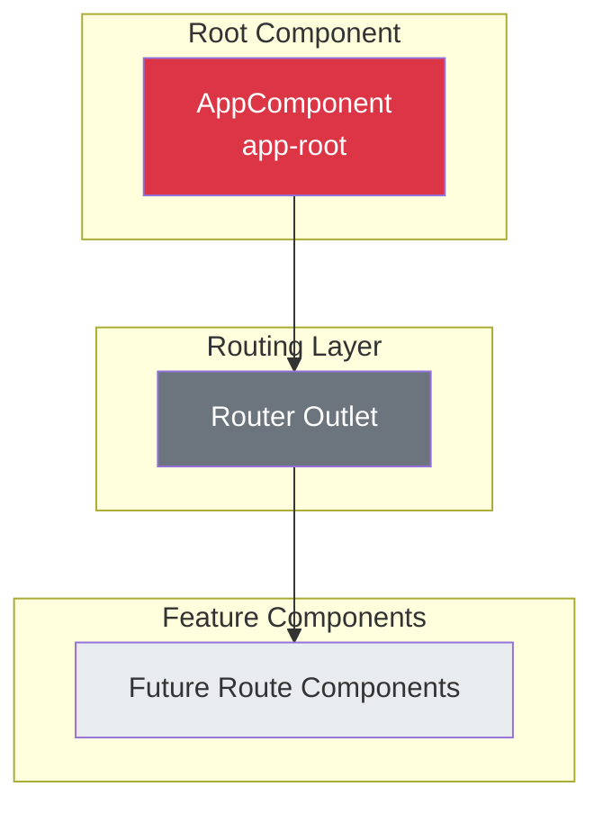
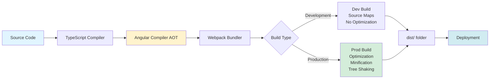
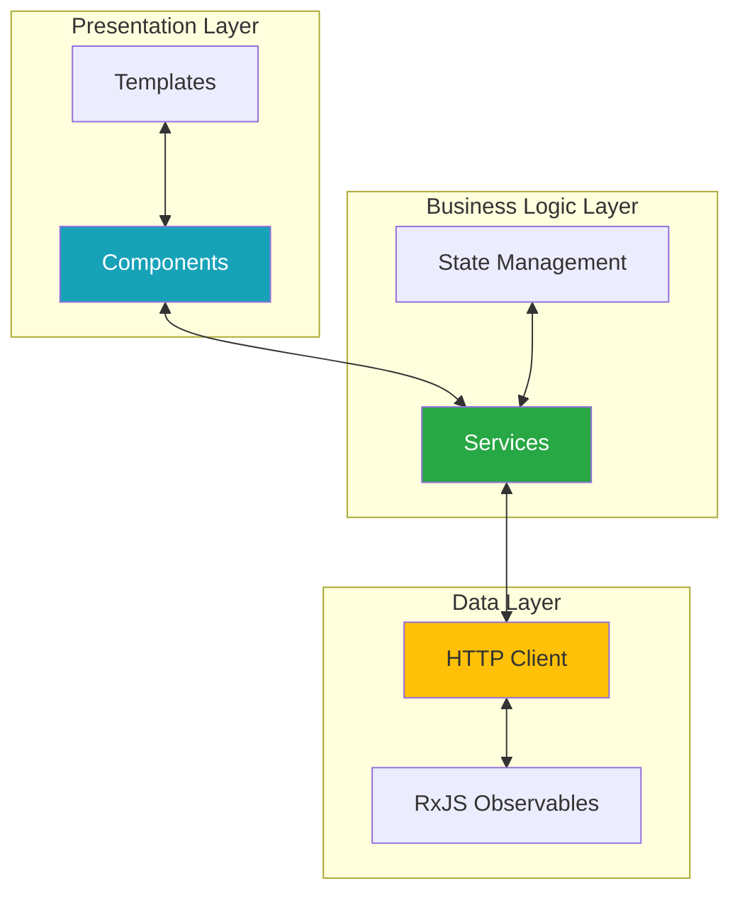

# Agular2020

A modern Angular 20 web application built with TypeScript, RxJS, and Angular CLI.

## Table of Contents

- [Overview](#overview)
- [Architecture](#architecture)
  - [Application Bootstrap Flow](#application-bootstrap-flow)
  - [Module Structure](#module-structure)
  - [Component Hierarchy](#component-hierarchy)
  - [Build Pipeline](#build-pipeline)
- [Technology Stack](#technology-stack)
- [Project Structure](#project-structure)
- [Getting Started](#getting-started)
- [Development](#development)
- [Testing](#testing)
- [Build & Deployment](#build--deployment)

## Overview

This project is an Angular 20 single-page application (SPA) that leverages the latest features of the Angular framework. It was initially generated with Angular CLI version 9.1.0 and has been upgraded to Angular 20, incorporating modern best practices and tooling.

## Architecture

### Application Bootstrap Flow

The application follows Angular's standard bootstrap process, which initializes the application in the browser:



**Flow Description:**
1. **index.html** - Entry point that loads the application
2. **main.ts** - Application entry point that bootstraps the Angular app
3. **Environment Check** - Determines if running in production or development mode
4. **platformBrowserDynamic** - Angular platform for browser-based applications
5. **AppModule** - Root module that configures the application
6. **AppComponent** - Root component that serves as the application shell

### Module Structure

The application uses Angular's modular architecture for better organization and code reusability:



**Module Responsibilities:**
- **AppModule**: Root module that declares components and imports feature modules
- **AppRoutingModule**: Handles application routing and navigation
- **BrowserModule**: Provides services essential for running Angular in the browser

### Component Hierarchy

Current component structure of the application:



**Component Details:**
- **AppComponent** (`selector: app-root`): The root component that serves as the application shell
- **Router Outlet**: Placeholder for dynamically loaded route components
- **Future Components**: Extensible architecture ready for feature components

### Build Pipeline

The application build and deployment process:



**Build Features:**
- **TypeScript Compilation**: Converts TypeScript to JavaScript
- **AOT Compilation**: Ahead-of-Time compilation for better performance
- **Webpack**: Module bundler for optimizing assets
- **Production Optimizations**:
  - Code minification
  - Tree shaking (removes unused code)
  - Output hashing for cache busting
  - Bundle size budgets (Initial: max 5MB, Component styles: max 10KB)

### Data Flow Architecture



## Technology Stack

| Technology | Version | Purpose |
|------------|---------|---------|
| **Angular** | 20.0.0 | Frontend framework |
| **TypeScript** | ~5.8.0 | Type-safe JavaScript |
| **RxJS** | ^7.8.1 | Reactive programming |
| **Zone.js** | ^0.15.0 | Change detection |
| **Jasmine** | ^5.1.4 | Testing framework |
| **Karma** | ^6.4.4 | Test runner |
| **Angular CLI** | ^20.0.0 | Development tooling |

## Project Structure

```
agular2020/
├── e2e/                          # End-to-end tests
│   └── src/
├── src/
│   ├── app/
│   │   ├── app-routing.module.ts # Routing configuration
│   │   ├── app.component.ts      # Root component
│   │   ├── app.component.html    # Root template
│   │   ├── app.component.css     # Root styles
│   │   ├── app.component.spec.ts # Root component tests
│   │   └── app.module.ts         # Root module
│   ├── assets/                   # Static assets
│   ├── environments/             # Environment configurations
│   │   ├── environment.ts        # Development environment
│   │   └── environment.prod.ts   # Production environment
│   ├── index.html                # Main HTML file
│   ├── main.ts                   # Application entry point
│   ├── polyfills.ts              # Browser polyfills
│   ├── styles.css                # Global styles
│   └── test.ts                   # Test configuration
├── angular.json                  # Angular CLI configuration
├── package.json                  # Dependencies and scripts
├── tsconfig.json                 # TypeScript configuration
├── tsconfig.app.json             # App-specific TS config
├── tsconfig.spec.json            # Test-specific TS config
└── karma.conf.js                 # Karma test configuration
```

## Getting Started

### Prerequisites

- **Node.js**: v18 or higher
- **npm**: v9 or higher
- **Angular CLI**: v20.0.0

### Installation

```bash
# Clone the repository
git clone <repository-url>

# Navigate to project directory
cd agular2020

# Install dependencies
npm install
```

## Development

### Development Server

Run the development server:

```bash
npm start
# or
ng serve
```

Navigate to `http://localhost:4200/`. The application will automatically reload when you make changes to source files.

### Code Scaffolding

Generate new components, services, and other Angular artifacts:

```bash
# Generate a new component
ng generate component component-name

# Generate a new service
ng generate service service-name

# Other generators
ng generate directive|pipe|service|class|guard|interface|enum|module
```

### Development Guidelines

1. **Component Design**: Keep components focused and single-purpose
2. **Services**: Use services for shared business logic and data access
3. **Routing**: Define routes in `app-routing.module.ts`
4. **State Management**: Consider using services with RxJS for state management
5. **TypeScript**: Leverage TypeScript's type system for better code quality

## Testing

### Unit Tests

Run unit tests via Karma:

```bash
npm test
# or
ng test
```

Tests are written using Jasmine and executed in Chrome browser.

### End-to-End Tests

Run e2e tests:

```bash
ng e2e
```

E2E tests use Protractor to simulate user interactions.

### Test Coverage

Generate code coverage report:

```bash
ng test --code-coverage
```

Coverage reports are generated in the `coverage/` directory.

## Build & Deployment

### Development Build

```bash
npm run build
# or
ng build
```

Build artifacts are stored in the `dist/agular2020/` directory.

### Production Build

```bash
ng build --configuration production
```

**Production Optimizations:**
- Ahead-of-Time (AOT) compilation
- Production mode enabled
- Code minification and uglification
- Tree shaking to remove unused code
- Output hashing for cache busting
- Source maps disabled
- Extract licenses

### Build Configuration

Build budgets are configured to maintain performance:
- **Initial Bundle**: Warning at 2MB, Error at 5MB
- **Component Styles**: Warning at 6KB, Error at 10KB

## Environment Configuration

Configure environment-specific settings:

- **Development**: `src/environments/environment.ts`
- **Production**: `src/environments/environment.prod.ts`

Example:
```typescript
export const environment = {
  production: false,
  apiUrl: 'http://localhost:3000/api'
};
```

## Further Help

- **Angular Documentation**: [angular.io](https://angular.io)
- **Angular CLI**: Run `ng help` or visit [Angular CLI Documentation](https://angular.io/cli)
- **TypeScript**: [TypeScript Documentation](https://www.typescriptlang.org/docs/)
- **RxJS**: [RxJS Documentation](https://rxjs.dev/)

## Contributing

1. Create a feature branch
2. Make your changes
3. Write/update tests
4. Ensure all tests pass
5. Submit a pull request

## License

This project is licensed under the MIT License.
